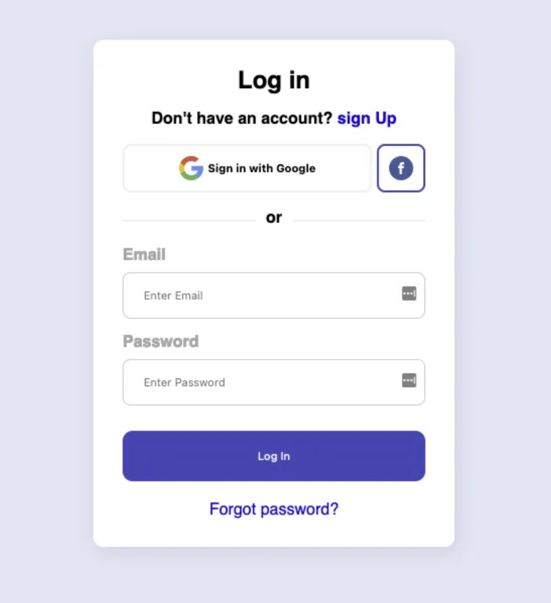

# 📝 Where's My HTML?

---

### 💡 Project Explanation

**Our UX designer has provided us with the UI design for a key part of our website: the *log in* page. We are going to structure only the HTML code.**  
🚫 **Do not add any CSS.**

---

### 📌 What are we going to do?

We’ll create the HTML structure of a Log In form based on a given UI design.  

---

### 🗂️ Where are we going to do it?

We will work on an HTML file that will be saved inside a specific folder.

---

### 🧱 How are we going to do it?

We’ll use semantic HTML5 tags to structure the content, paying attention to how the “boxes” or elements are organized, so that another developer can later add CSS styles.

---

### 🛠️ What are we going to use?

We’ll use **HTML5** and a text editor like **Visual Studio Code**.  
❗ Only HTML is allowed — no CSS.

---

### 📊 How will it be evaluated?

The project will be evaluated based on:

- The **structure and semantics** of the HTML.
- The **clear and logical organization** of the page elements.

---

### 🎯 Project Goal

In this **pair-programming activity**, the main goal is to **create the HTML structure for a Log In form**, applying different levels of understanding of web layout.  
You’ll also practice pushing the project to a GitHub repository, applying **Git** and **Gitflow** best practices.

### 👥 Team Members

- [Ana Carina Pillajo](https://github.com/acpp2510)  
- [Morena Peralta](https://github.com/More-Pe)